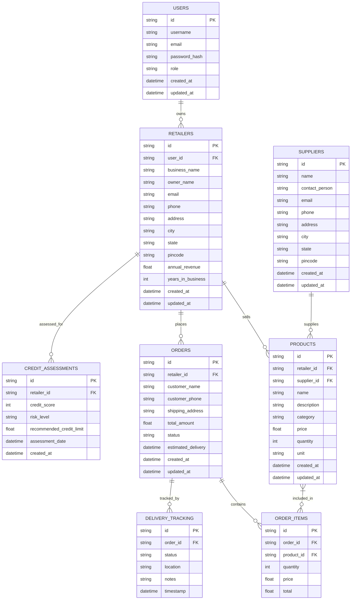

# Mini Bharat AI Store - Database Schema Design

## Overview
This document outlines the database schema for the Mini Bharat AI Store, an Integrated Retail Intelligence System for Kirana stores.

## Entity Relationship Diagram

## Database Tables

### 1. Users
Stores information about all users of the system.

| Column | Type | Constraints | Description |
|--------|------|-------------|-------------|
| id | VARCHAR(36) | PRIMARY KEY | Unique user identifier |
| username | VARCHAR(50) | UNIQUE, NOT NULL | User's login name |
| email | VARCHAR(100) | UNIQUE, NOT NULL | User's email address |
| password_hash | VARCHAR(255) | NOT NULL | Hashed password |
| role | VARCHAR(20) | NOT NULL | User role (admin, retailer, supplier) |
| created_at | DATETIME | NOT NULL | Record creation timestamp |
| updated_at | DATETIME | NOT NULL | Record last update timestamp |

### 2. Retailers
Stores information about Kirana store retailers.

| Column | Type | Constraints | Description |
|--------|------|-------------|-------------|
| id | VARCHAR(36) | PRIMARY KEY | Unique retailer identifier |
| user_id | VARCHAR(36) | FOREIGN KEY | Reference to Users table |
| business_name | VARCHAR(100) | NOT NULL | Name of the Kirana store |
| owner_name | VARCHAR(100) | NOT NULL | Name of the store owner |
| email | VARCHAR(100) | UNIQUE | Business email address |
| phone | VARCHAR(20) | NOT NULL | Business phone number |
| address | TEXT | NOT NULL | Business address |
| city | VARCHAR(50) | NOT NULL | City |
| state | VARCHAR(50) | NOT NULL | State |
| pincode | VARCHAR(10) | NOT NULL | Postal code |
| annual_revenue | DECIMAL(15,2) | NOT NULL | Annual business revenue |
| years_in_business | INT | NOT NULL | Years of business operation |
| created_at | DATETIME | NOT NULL | Record creation timestamp |
| updated_at | DATETIME | NOT NULL | Record last update timestamp |

### 3. Suppliers
Stores information about product suppliers.

| Column | Type | Constraints | Description |
|--------|------|-------------|-------------|
| id | VARCHAR(36) | PRIMARY KEY | Unique supplier identifier |
| name | VARCHAR(100) | NOT NULL | Supplier company name |
| contact_person | VARCHAR(100) | NOT NULL | Contact person name |
| email | VARCHAR(100) | NOT NULL | Contact email |
| phone | VARCHAR(20) | NOT NULL | Contact phone |
| address | TEXT | NOT NULL | Supplier address |
| city | VARCHAR(50) | NOT NULL | City |
| state | VARCHAR(50) | NOT NULL | State |
| pincode | VARCHAR(10) | NOT NULL | Postal code |
| created_at | DATETIME | NOT NULL | Record creation timestamp |
| updated_at | DATETIME | NOT NULL | Record last update timestamp |

### 4. Products
Stores information about products in inventory.

| Column | Type | Constraints | Description |
|--------|------|-------------|-------------|
| id | VARCHAR(36) | PRIMARY KEY | Unique product identifier |
| retailer_id | VARCHAR(36) | FOREIGN KEY | Reference to Retailers table |
| supplier_id | VARCHAR(36) | FOREIGN KEY | Reference to Suppliers table |
| name | VARCHAR(100) | NOT NULL | Product name |
| description | TEXT | | Product description |
| category | VARCHAR(50) | NOT NULL | Product category |
| price | DECIMAL(10,2) | NOT NULL | Selling price |
| quantity | INT | NOT NULL | Available quantity |
| unit | VARCHAR(20) | NOT NULL | Unit of measurement (kg, pcs, etc.) |
| created_at | DATETIME | NOT NULL | Record creation timestamp |
| updated_at | DATETIME | NOT NULL | Record last update timestamp |

### 5. Orders
Stores information about customer orders.

| Column | Type | Constraints | Description |
|--------|------|-------------|-------------|
| id | VARCHAR(36) | PRIMARY KEY | Unique order identifier |
| retailer_id | VARCHAR(36) | FOREIGN KEY | Reference to Retailers table |
| customer_name | VARCHAR(100) | NOT NULL | Customer name |
| customer_phone | VARCHAR(20) | NOT NULL | Customer phone |
| shipping_address | TEXT | NOT NULL | Delivery address |
| total_amount | DECIMAL(10,2) | NOT NULL | Total order amount |
| status | VARCHAR(20) | NOT NULL | Order status (pending, confirmed, shipped, delivered, cancelled) |
| estimated_delivery | DATETIME | | Estimated delivery date |
| created_at | DATETIME | NOT NULL | Record creation timestamp |
| updated_at | DATETIME | NOT NULL | Record last update timestamp |

### 6. Order Items
Stores individual items within an order.

| Column | Type | Constraints | Description |
|--------|------|-------------|-------------|
| id | VARCHAR(36) | PRIMARY KEY | Unique order item identifier |
| order_id | VARCHAR(36) | FOREIGN KEY | Reference to Orders table |
| product_id | VARCHAR(36) | FOREIGN KEY | Reference to Products table |
| quantity | INT | NOT NULL | Quantity ordered |
| price | DECIMAL(10,2) | NOT NULL | Price per unit |
| total | DECIMAL(10,2) | NOT NULL | Total for this item (quantity * price) |

### 7. Delivery Tracking
Stores delivery status updates for orders.

| Column | Type | Constraints | Description |
|--------|------|-------------|-------------|
| id | VARCHAR(36) | PRIMARY KEY | Unique tracking identifier |
| order_id | VARCHAR(36) | FOREIGN KEY | Reference to Orders table |
| status | VARCHAR(20) | NOT NULL | Delivery status |
| location | VARCHAR(100) | | Current location |
| notes | TEXT | | Additional notes |
| timestamp | DATETIME | NOT NULL | Status update timestamp |

### 8. Credit Assessments
Stores credit risk assessments for retailers.

| Column | Type | Constraints | Description |
|--------|------|-------------|-------------|
| id | VARCHAR(36) | PRIMARY KEY | Unique assessment identifier |
| retailer_id | VARCHAR(36) | FOREIGN KEY | Reference to Retailers table |
| credit_score | INT | NOT NULL | Calculated credit score (0-100) |
| risk_level | VARCHAR(10) | NOT NULL | Risk level (low, medium, high) |
| recommended_credit_limit | DECIMAL(15,2) | NOT NULL | Recommended credit limit |
| assessment_date | DATETIME | NOT NULL | Date of assessment |
| created_at | DATETIME | NOT NULL | Record creation timestamp |

## Indexes

### Performance Indexes
1. `idx_retailer_products` on `products(retailer_id)` - For quick product lookups by retailer
2. `idx_supplier_products` on `products(supplier_id)` - For quick product lookups by supplier
3. `idx_retailer_orders` on `orders(retailer_id)` - For quick order lookups by retailer
4. `idx_order_status` on `orders(status)` - For filtering orders by status
5. `idx_order_tracking` on `delivery_tracking(order_id)` - For quick tracking lookups
6. `idx_retailer_credit` on `credit_assessments(retailer_id)` - For credit assessment lookups

## Relationships

1. **One-to-Many**: Users → Retailers (One user can own multiple retailer accounts)
2. **One-to-Many**: Retailers → Products (One retailer can have multiple products)
3. **One-to-Many**: Suppliers → Products (One supplier can supply multiple products)
4. **One-to-Many**: Retailers → Orders (One retailer can place multiple orders)
5. **One-to-Many**: Orders → Order Items (One order can contain multiple items)
6. **One-to-Many**: Orders → Delivery Tracking (One order can have multiple tracking updates)
7. **One-to-Many**: Retailers → Credit Assessments (One retailer can have multiple assessments)

## Data Constraints

1. **Email Format**: All email fields must follow valid email format
2. **Phone Format**: Phone numbers must follow valid Indian phone number format
3. **Price**: Must be positive decimal values
4. **Quantity**: Must be non-negative integers
5. **Status Values**: 
   - Orders: pending, confirmed, shipped, delivered, cancelled
   - Delivery Tracking: pending, confirmed, in_transit, delivered, cancelled
   - Credit Risk: low, medium, high
6. **Timestamps**: All timestamps must be in UTC format